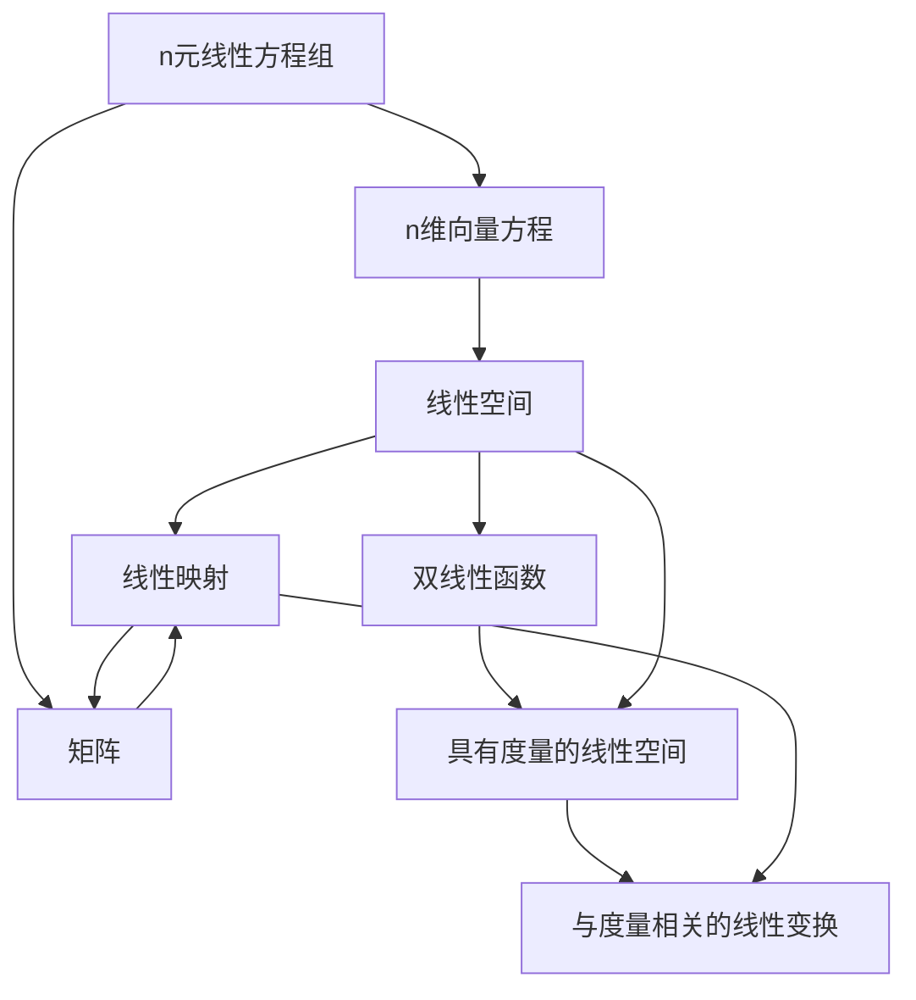

> 听课的时候做点东西，加强记忆，不保证质量

线性代数的主线：研究线性空间的线性映射

一元高次方程的求根

$a_nx^n+a_{n-1}x^{n-1}+\dots+a_1x+a_0=0$

其集合为一元多项式环，引出了环的概念，扩展为域的概念

引入了群的概念，为了求根

n阶方程可以自然化为行阶梯型，具备主元与自由元，其个数与解的个数相关

解的个数：无解，唯一解，无穷解

行列式中使用了n元排列，每个排列具有逆序数的概念，逆序数的对换会改变奇偶性

证明时可以从相邻数开始推广

列指标为奇排列时行列式为负号

可以根据此扩展到行与列指标的逆序数的关系

进一步引出矩阵转置不改变行列式

由逆序数可以引出行/列交换导致的符号改变

将$a_{ij}$放在开头，结合逆序数，可以轻松推出行列式的展开式

Caemer法则：行列式与解的关系

laplace定理：行列式的k阶展开：在$n$级矩阵$A$中，取定第$i_1,i_2,\cdots,i_k$行($i_1 < i_2 < \cdots < i_k$)，则这$k$行元素形成的所有$k$阶子式与它们自己的代数余子式的乘积之和等于$|A|$ 

定义域对应陪域，陪域包含值域（像）

S上的代数运算：$S\times S$到$S$上的映射

加法与数量乘法的定义

向量组互相表示即等价（自反性，对称性，传递性）

空集线性无关，零空间的基为空集（规定出来的，基于基是一个极大无关组）

向量在标准基上的坐标就是自己（理解这个，去感受什么是输入空间与输出空间）

向量组的延伸组与缩短组

线性相关的向量组的缩短组依旧相关

线性无关的向量组合的延伸组依旧线性无关

阶梯型矩阵的延伸组可以从两个方向思考

矩阵到方程到方程同解到线性相关性不改变再引出初等变换不改变秩

> 纯数值证明是真的很烂

由阶梯形矩阵得到行变换不改变行秩，证明阶梯形矩阵的行列的秩相等，证明行变换不改变列秩，得到一般性的行列的秩相等

> 太漂亮了

由此可以得到主元对应的向量极大线性无关

非齐次线性方程组的解集$U=\gamma_0+W$称为$W$型的一个线性流型（陪集），$W$为零解,$\gamma_0$为特解

$dim(V_1+V_2)=dim(V_1)+dim(V_2)-dim(V_1\cap V_2)$

直和的定义，表出方式唯一

$V_i\cap(\sum_{j\neq i}V_j)=\textbf{0}$

 同构映射：双射，保持加法，保持数乘

> 对应线性空间的同构

同构映射是可逆映射的一个子集

可逆映射基于恒定映射定义

$S$上的一个二元关系：$S\times {S}$的一个子集$W$

若$(a,b)\in W$则称$a$与$b$有$W$关系，$a \underset{W}\sim b$,或$a\sim b$

若二元关系满足反身性，对称性，传递性，称为等价关系

设$\sim$为$S$上的一个等价关系，任意给$a\in S$，称$\{\bar a:={x\in S|x\sim a}\}$为$a$的等价类，$a$为$\bar a$的一个代表

$\bar a =\bar b \iff a\sim b \iff b-a\in W$,$W$为一个子空间，即$\bar a$为$a+W$,即$W$的一个陪集，即以$a$为代表的一个陪集

$\bar a \neq \bar b\iff \bar a \cap\bar b=\varnothing$

$S$上存在一个等价关系，则所有等价类的并集为$S$的一个划分（商集）

如果$S$存在一个划分，那么一定可以得到一个等价关系

$\alpha+W=\gamma+W\iff \alpha\sim \gamma \iff \alpha-\gamma \in W$

$\beta \in W \iff \beta+W=\textbf{0}+W=W$

商集$V\backslash W:={\gamma +W|\gamma\in V}$

$(\alpha +W)+(\beta+W):=(\alpha+\beta)+W$

$k(\alpha +W):=(k\alpha)+W$

> 定义式子，需要证明与陪集的代表选择无关

$W$为$V\backslash W$的零元，易证$V\backslash W$为线性空间

设 V 是域 F 上一个有限维线性空间, W 是 V 的一个子空间, 则$$ \dim(V / W)=\dim V-\dim W$$

> 记住$W$上零元，由$W$的基扩充到$V$的基,根据定义写商集，得到商集的基（以W的补空间的基为代表的陪集），最后证明线性无关

由商集的集到补空间的基的证明需要严格考虑直和的概念，从这个下手

> 上述的证明没有限制空间的维度，对无限维依旧成立

> 矩阵乘法引出的合情合理，由旋转引出映射再到矩阵，由映射的性质引出矩阵的性质，而不是简单的定义

$rank(AB)<rank(A)$:$AB$的列向量组可以由$A$的列向量组线性表出

$E_{ij}$定义为仅第$i$第$j$列为1的矩阵，其他位置元素为0，也称为基本矩阵

矩阵所张开的线性空间的维数为$s\times n$

> 向量张成的线性空间和矩阵张成的线性空间是两个概念

上/下三角矩阵，对角矩阵，对称矩阵，反/斜对称矩阵($A^T=-A$)均可以是线性空间

由行列式展开引出矩阵的逆矩阵的运算以及伴随矩阵的概念

> 注意伴随矩阵的列对应行的代数余子式

分块矩阵的初等变换 

考虑$n\times s$与$s\times n$矩阵相乘的行列式，$n>s$时显然为0，$=$时使用初等行变换进行理解

$<$时构造分块行初等变换（可以不改变行列式）进行理解

$ |AB| $等于A的所有s阶子式与B的相应s阶子式的乘积之和，即

$$ |AB|=\sum_{1\leqslant v_{1}<v_{2}<\cdots<v_{s}\leqslant n}A\left(\begin{array}{llll}1,2,\cdots, s\\v_{1},v_{2},\cdots,v_{s}\end{array}\right)\cdot B\left(\begin{array}{lll}v_{1},v_{2},\cdots,v_{s}\\1,2,\cdots,s\end{array}\right)$$

一元多项式的概念与不定元

$deg\ 0=-\infty$

$K[x]$表示数域$K$上的一元多项式，是无限维的线性空间

$deg(f(x)+g(x))\leq max\{deg(f(x)),deg(g(x))\}$

环：非空集合，存在加法，乘法封闭性，加法满足交换律，结合律且存在加法零元和负元，乘法满足结合律和左右分配律

若乘法满足交换律，称为交换环

若存在左/右乘不改变元素，称为单位元（仅一个），记为1

左零因子与右零因子，统称为零因子

零元也是零因子，称为平凡的零因子

 非空子集$R_1$为子环$\iff$从$a\in R_1,b\in R_1$可以推出$a-b\in R_1,ab\in R_1$

矩阵的多项式是一个子环，且是具有单位元的交换环

$KI$是$K[A]$的一个子环

若两个环之间存在双射且满足加法保持性和乘法保持性，称该映射为同构映射

同构的两个环若其中一个有单位元，则另一个有单位元

扩环：$R$有子环$R_1$与单位元$1'$，$1'\in R_1$，数域$K$到$R_1$上有一个双射$\tau$，且保持加法与乘法，则$R$视为$K$的一个扩环

此时$\tau (1)=1'$

> 环不一定有单位元，如所有偶数组成的集合

**一元多项式环的通用性质**

设$K$是一个数域，$R$是一个有单位元$ 1' $的交换环，它可以看成是$K$的一个扩环，其中$K$到$R$的子环$ R_{1} $的保持加法和乘法运算的双射记作$ \tau $

任意给定$ t\in R $，令$$ \sigma_{t}:K[x]\longrightarrow R $$

$$ f(x)=\sum_{i=0}^{n}a_{i}x^{i}\quad\longmapsto\sum_{i=0}^{n}\tau(a_{i})t^{i}=:f(t) $$

则$ \sigma_{t} $是$K[x]$到$R$的一个映射，且$ \sigma_{t} $保持加法和乘法运算。即如果在$K[x]$中，有$$ f(x)+g(x)=h(x),\quad f(x)g(x)=p(x)$$

那么在R中，有$$ f(t)+g(t)=h(t),\quad f(t)g(t)=p(t); $$还有$ \sigma_{t}(x)=t $。映射$ \sigma_{t} $称为$x$用$t$代入。

> 建立了$K$的映射，就可以任意代入有单位元交换环，多么漂亮的公式

> $x$为啥叫不定元也可以理解了

设$f(x),g(x)\in K[x]$，如果存在$h(x)\in K[x]$，使得$f(x)=h(x)g(x)$，那么称$g(x)$整除$f(x)$，记作$g(x)\mid f(x)$；否则，称$g(x)$不能整除$f(x)$，记作$g(x)\nmid f(x)$。

> 要注意$h(x)\in K[x]$这个条件

0多项式仅能整除0多项式，同时可以被任意多项式整除

整除关系是一个二元关系，且具有反射性，传递性，但是无对称性

$g(x)\mid f(x)$且$f(x)\mid g(x)$称$g(x) $,$f(x)$相伴，记为$f(x)\sim g(x)$

带余除法:设$f(x),g(x)\in K[x]$,且$g(x)\neq 0$,则在$K[x]$中存在唯一的一对多项式$h(x),r(x)$,使得
$$f(x)=h(x)g(x)+r(x),\quad \text{deg}r(x)<\text{deg}g(x)$$其中$f(x),g(x)$分别叫作被除式、除式,$h(x),r(x)$分别叫作商式、余式

整除性不随数域的扩大而改变

> 不要想着一个数域上不能整除的两个式子换个数域就能整除了

任意公因式多项式可以整除最大公因式

$f(x)$与$0$多项式的最大公因式是$f(x)$

引理 :设 $f(x)$, $g(x) \in K[x]$，如果在 $K[x]$ 中有$$ f(x)=h(x)g(x)+r(x)$$，$d(x)$ 是 $f(x)$ 与 $g(x)$ 的最大公因式当且仅当 $d(x)$ 是 $g(x)$ 与 $r(x)$ 的最大公因式

> 由上面两条，自然引出了辗转相除法

对于最大公因式$d(x)$，存在$u(x),v(x)\in K[x]$，使得$$ d(x)=u(x)f(x)+v(x)g(x)$$

>由辗转相除法的过程可以理解，对于0多项式单独讨论即可

$(f(x),g(x))$表示首一最大公因式（不随数域扩大改变）

**若$(f(x),g(x))=1$称为互素$\iff$存在$u(x),v(x)\in K[x]$，使得$$u(x)f(x)+v(x)g(x)=1$$**

> 及其重要的结论

互素性不随数域的扩大而改变

> 由首一最大公因式不随数域扩大改变得到

在$K[x]$中，如果$$ f(x) \mid g(x)h(x)$$且$$ (f(x), g(x)) = 1,$$那么$$ f(x) \mid h(x)$$

在$K[x]$中，如果$f(x) \mid h(x)$, $g(x) \mid h(x)$, 且$(f(x), g(x)) = 1$, 那么$f(x)g(x) \mid h(x)$

若$(f_{i}(x),h(x))=1, i=1,2,\cdots,s$, 则$$ (f_{1}(x)f_{2}(x)\cdots f_{s}(x),h(x))=1 $$.

不可约多项式：因式仅有零项多项式和自己的相伴元

> 不能分解为其他的次数比其低的因式

不可约多项式经整除的传递性以及结合定义可以得到要么与其他多项式互素，要么可以整除其他多项式

唯一因式分解定理：$K[x]$中任一次数大于0的多项式$f(x)$能够唯一地分解成数域$K$上有限多个不可约多项式的乘积。所谓唯一性是指，如果$f(x)$有两个这样的分解式：$$ f(x)=p_{1}(x)p_{2}(x)\cdots p_{s}(x)=q_{1}(x)q_{2}(x)\cdots q_{t}(x), $$

那么一定有$s=t$，且适当排列因式的次序后有$$ p_{i}(x)\sim q_{i}(x),\quad i=1,2,\cdots, s$$

> 由数学归纳法推导结合不可约多项式定义可以获得

重因式的概念略

在$K[x]$中,设$f(x)$与$g(x)$的次数都不超过$n$,如果$K$中有$n+1$个不同的数$c_1,\ldots, c_{n+1}$,使得$$f(c_i)=g(c_i), \quad i=1,2,\ldots,n+1,$$那么$f(x)=g(x)$

> 根据根个数与根的关系可以得到

多项式函数和多项式是两个不一样的东西

> 多项式函数由多项式诱导而来

Liouvill定理：在复平面 $\mathbb{C}$ 上解析且有界的函数必为常值函数

代数基本定理:每一个次数 $>0$ 的复系数多项式至少有一个复根

> 借助Liouvill定理由反证法得到

因此复数域中的不可约多项式只有一次多项式

实数域上不可约多项式只有一次多项式和判别式小于0的二次多项式

本原多项式:各项系数的公因数只有正负1

本原多项式的乘积也是本原多项式(反证法证明，即高斯引理)

由此推出可约本原多项式可以分解为两个次数较低的本原多项式的乘积

推出可约整系数多项式可以分解为两个次数较低的整系数多项式多项式的乘积

一个次数n大于0的整系数多项式，如果$$ \frac{q}{p} $$是其一个有理根，其中p,q是互素的整数，那么$$ p|a_{n},\quad q|a_{0} $$

> 由上面的结论可以推导

可以判断:二次或三次整系数多项式在$\mathbb{Q}$上不可约当且仅当它没有有理根

> 因为它们可约一定要分解出一个一次多项式，可以理解这个对4次的不成立

Eisenstein判别法(充分条件):设$$ f(x)=a_{n} x^{n}+a_{n-1} x^{n-1}+\cdots +a_{1} x+a_{0} $$是一个次数n大于0的本原多项式。如果存在一个素数p，使得$$p\mid a_{i},\ i=0,1, \cdots, n-1; $$$$p \nmid a_{n};$$,$$p^{2} \nmid a_{0}$$那么$f(x)$**在$\mathbb{Q}$上不可约**

由此可以得到无穷多项的有理数域上的多项式

> 可以将不定元$x$用诸如$x+1$等式子代入再进行判别

模m的剩余类进行加法和乘法的定义后可以形成一个环

域:有单位元的交换环且非0元都是可逆元

若$p$是素数，则$Z_p$为域

对于域若$ne=0$则$n$必须为素数，称该域的特征为$n$，反之为$0$,如数域

> $n$为使得单位元相加为0的最小倍数

有限域上定义的多项式诱导的函数相等无法推出多项式相等

> 函数的相等是根据根来定义的

代数系统：环（加法4条，乘法2条）,域（交换环，单位域，可逆），域上的线性空间（加法4,纯量乘法4）

到自身的线性映射称为线性变换

线性映射不要求单射与满射

当线性相关向量的线性映射依旧线性相关

$Hom(V,V)$表示$V$到$V$上的全部集合，是一个线性空间，而且是一个环且有单位元

幂等变换:$A^2=A$($A$是映射)

核空间：映射为0向量的空间

单射的映射核空间为0空间（充要条件）

$\mathcal{A}$是域$F$上线性空间$V$到$V'$的一个线性映射，令
$$
\sigma: V / \operatorname{Ker}\mathcal{A} \longrightarrow \operatorname{Im}\mathcal{A} 
$$
$$
\alpha+\operatorname{Ker}\mathcal{A} \longmapsto \mathcal{A}\alpha
$$
则$\sigma$是$V/\operatorname{Ker}\mathcal{A}$到$\operatorname{Im}\mathcal{A}$的一个同构映射，从而$$ V / \operatorname{Ker}\mathcal{A} \cong \operatorname{Im}\mathcal{A}。 $$

由这个结论根据同构的维数得到核秩与象秩的和

定义象的秩为映射的秩

**有限维**映射$A$的单射$\iff$满射$\iff$双射

> 同维度空间之间的映射就行，不要求是变换

线性变换在不同基下对应的矩阵不同

> 将映射和矩阵的符号加以区分真的容易理解

$$
\begin{array}{c}
\operatorname{Hom}\left(V, V^{\prime}\right)\cong M_{s\times n}(F),\\
\operatorname{dim}\left(\operatorname{Hom}\left(V, V^{\prime}\right)\right)=s n=(\operatorname{dim} V)\left(\operatorname{dim} V^{\prime}\right)
\end{array}
$$

> 根据基的表法唯一得到映射唯一进一步由满射得到单射条件

过渡矩阵的概念与顺序问题

相同的映射针对不同的基引出相似矩阵的概念
$$
\left[ \begin{array}{l} \text{线性} \\ \text{映射} \end{array} \right] \left[ \begin{array}{l} \text{入口} \\ \text{矩阵} \end{array} \right] = \left[ \begin{array}{l} \text{出口} \\ \text{矩阵} \end{array} \right] \left[ \begin{array}{l} \text{表示} \\ \text{矩阵} \end{array} \right]
$$
相似矩阵的迹相等

迹的几条运算

线性变换的行列式，迹，秩由相似引出

> 此时秩有两种表示，证明等价：由象空间与映射基的向量的张成空间相等得到维数关系，由映射与坐标之间的双射关系得到秩相等

不同的特征值对应的线性空间的基线性无关

相似矩阵特征值相同
$$
\begin{aligned}
|\lambda \boldsymbol{I}-\boldsymbol{A}|= & \lambda^{n}-\operatorname{tr}(\boldsymbol{A}) \lambda^{n-1}+\cdots+(-1)^{k} \sum_{1 \leqslant j_{1}^{\prime}<j_{2}^{\prime}<\cdots<j_{k}^{\prime} \leqslant n} \boldsymbol{A}\left(\begin{array}{l}
j_{1}^{\prime}, j_{2}^{\prime}, \cdots, j_{k}^{\prime} \\
j_{1}^{\prime}, j_{2}^{\prime}, \cdots, j_{k}^{\prime}
\end{array}\right) \lambda^{n-k}  +\cdots+(-1)^{n}|\boldsymbol{A}| .
\end{aligned}
$$
